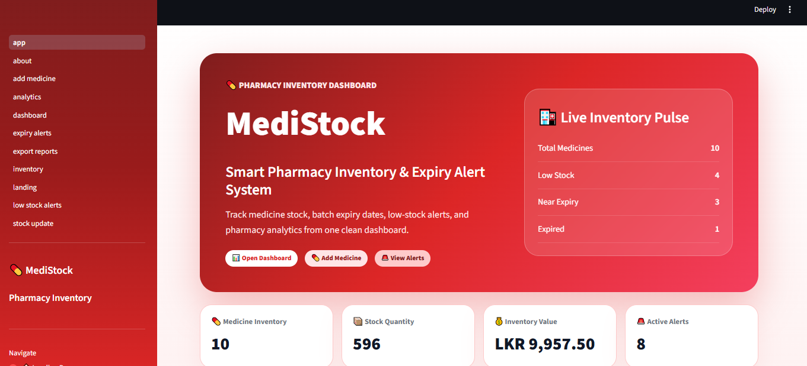
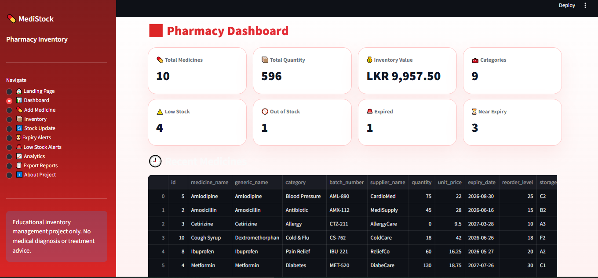
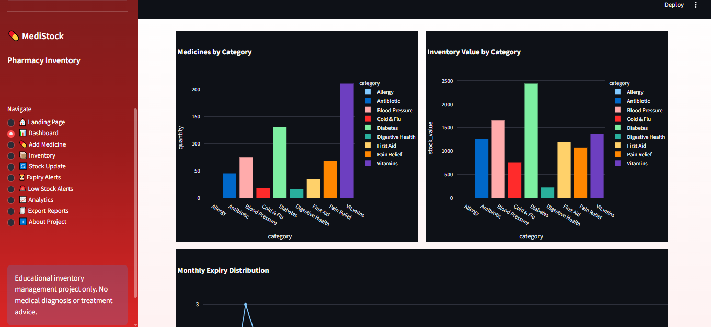

<div align="center">

### 🏥 Pharmacy Inventory Alert System


<br/>


<br/>


<br/>

### 🚨 Smart red-themed pharmacy dashboard for medicine stock, expiry alerts, low-stock monitoring, analytics, and CSV reports.

**MediStock** is a modern **Python + Streamlit + SQLite** mini project built for healthcare-tech portfolio value. It helps pharmacies manage medicine inventory, batch expiry dates, stock movements, alerts, and reports from one clean dashboard.

<br/>


</div>

---

## 📸 Project Preview

<div align="center">

### 🏥 Landing Page



<br/>
<br/>

### 📊 Pharmacy Dashboard



<br/>
<br/>

### 📈 Analytics Graphs



</div>

---

## 🚀 Overview

**MediStock** is a red medical-themed **pharmacy inventory management dashboard** built with **Python, Streamlit, SQLite, pandas, and Plotly**.

The system helps pharmacy staff track medicine stock, batch numbers, expiry dates, low-stock items, expired medicines, near-expiry medicines, inventory value, stock movements, analytics charts, and downloadable CSV reports.

> ⚠️ **Medical Scope Disclaimer:**
> This project is for **pharmacy inventory management** and **educational portfolio use only**. It does **not** provide medical diagnosis, treatment advice, dosage recommendations, drug interaction advice, or emergency medical guidance.

---

## 🎯 Project Purpose

| Area                  | What This Project Shows                                              |
| --------------------- | -------------------------------------------------------------------- |
| 🐍 Python Development | Modular Python project structure with services, utilities, and pages |
| 🏥 Healthcare-Tech    | Pharmacy stock, expiry, and inventory alert workflow                 |
| 📊 Data Dashboard     | Streamlit UI, metrics, tables, filters, and Plotly charts            |
| 🗄️ Database Skills   | SQLite schema, CRUD operations, and demo seed data                   |
| 🧾 Reporting          | CSV export reports for inventory, stock, expiry, and alerts          |
| ✅ Validation          | Strong input validation and friendly user feedback                   |
| 🎨 UI/UX              | Custom red medical SaaS-style Streamlit interface                    |

---

## ✨ Key Features

### 💊 Medicine Inventory Management

* ➕ Add new medicines
* 🏷️ Track batch numbers
* 🧪 Store generic names
* 🗂️ Categorize medicines
* 🏭 Track suppliers
* 📦 Manage quantity
* 💰 Track unit price
* ⏳ Store expiry date
* 🚨 Set reorder level
* 📍 Track storage location
* 📝 Add notes

---

### 🚨 Alert System

* 🔴 Expired medicine alerts
* 🟠 Near-expiry medicine alerts
* ⚠️ Low-stock medicine alerts
* 🚫 Out-of-stock detection
* ⏳ Days remaining calculation
* 🧾 Reorder recommendation
* 🏷️ Status badges:

  * In Stock
  * Low Stock
  * Out of Stock
  * Near Expiry
  * Expired

---

### 🔄 Stock Movement Tracking

* 📥 Stock In
* 📤 Stock Out
* 🔧 Stock Adjustment
* 🧮 Prevents negative stock
* 🕘 Records previous quantity
* 📌 Records new quantity
* 📝 Adds stock movement notes
* 📋 Shows stock movement history

---

### 📊 Dashboard & Analytics

* 💊 Total medicines count
* 📦 Total stock quantity
* 💰 Total inventory value
* ⚠️ Low-stock count
* 🚫 Out-of-stock count
* 🔴 Expired medicine count
* ⏳ Near-expiry count
* 🗂️ Category count
* 📈 Medicines by category chart
* 💵 Inventory value by category chart
* 🥧 Expiry status distribution
* 📉 Lowest stock medicines
* 💰 Most valuable medicines
* 📆 Monthly expiry distribution

---

### 🧾 CSV Export Reports

* 📄 Full inventory report
* 🚨 Low-stock report
* 🔴 Expired medicine report
* ⏳ Near-expiry report
* 📊 Stock summary report
* 🕒 Timestamped CSV file names
* ⬇️ One-click download buttons

---

## 🧰 Tech Stack

| Layer              | Technology   |
| ------------------ | ------------ |
| 🐍 Language        | Python 3.10+ |
| 🎨 UI Framework    | Streamlit    |
| 🗄️ Database       | SQLite       |
| 📊 Data Processing | pandas       |
| 📈 Charts          | Plotly       |
| 🧾 Export          | CSV          |
| 📁 File Handling   | pathlib      |
| 📅 Date Logic      | datetime     |
| 🎨 Styling         | Custom CSS   |

---

## 🎨 UI Theme

MediStock uses a **red medical dashboard theme** designed to feel like a modern healthcare SaaS product.

| Color Role          | Hex       |
| ------------------- | --------- |
| Primary Red         | `#DC2626` |
| Dark Red            | `#991B1B` |
| Emergency Red       | `#EF4444` |
| Rose Red            | `#F43F5E` |
| Soft Red Background | `#FEF2F2` |
| Light Rose          | `#FFE4E6` |
| Border Red          | `#FECACA` |
| Success Green       | `#16A34A` |
| Warning Amber       | `#F59E0B` |
| Danger Red          | `#B91C1C` |

---

## 🏗️ System Architecture

```text
┌──────────────────────────────┐
│      Streamlit Frontend       │
│  Red Medical Dashboard UI     │
└───────────────┬──────────────┘
                │
                │ Service Layer
                ▼
┌──────────────────────────────┐
│     Python Service Modules    │
│ Inventory / Analytics / CSV   │
└───────────────┬──────────────┘
                │
                │ Parameterized SQLite Queries
                ▼
┌──────────────────────────────┐
│          SQLite DB            │
│ Medicines / Stock Movements   │
└──────────────────────────────┘
```

---

## 🗄️ Database Design

### `medicines`

```text
id
medicine_name
generic_name
category
batch_number
supplier_name
quantity
unit_price
expiry_date
reorder_level
storage_location
notes
created_at
updated_at
```

### `stock_movements`

```text
id
medicine_id
movement_type
quantity_change
previous_quantity
new_quantity
note
created_at
```

---

## 📁 Project Structure

```text
medistock-pharmacy-inventory-alert-system/
├── app.py
├── requirements.txt
├── README.md
├── .gitignore
│
├── data/
│   └── .gitkeep
│
├── exports/
│   └── .gitkeep
│
├── screenshots/
│   ├── Landing.PNG
│   ├── Dashboard.PNG
│   └── Graph.PNG
│
├── database/
│   ├── __init__.py
│   └── db.py
│
├── services/
│   ├── __init__.py
│   ├── inventory_service.py
│   ├── analytics_service.py
│   └── export_service.py
│
├── utils/
│   ├── __init__.py
│   ├── validators.py
│   ├── helpers.py
│   └── styles.py
│
└── pages/
    ├── __init__.py
    ├── landing.py
    ├── dashboard.py
    ├── add_medicine.py
    ├── inventory.py
    ├── stock_update.py
    ├── expiry_alerts.py
    ├── low_stock_alerts.py
    ├── analytics.py
    ├── export_reports.py
    └── about.py
```

---

## ⚙️ Installation & Setup

### 1️⃣ Clone the repository

```bash
git clone https://github.com/LithiraLiyanage/medistock-pharmacy-inventory-alert-system.git
cd medistock-pharmacy-inventory-alert-system
```

### 2️⃣ Create a virtual environment

```bash
python -m venv .venv
```

### 3️⃣ Activate the virtual environment

Windows:

```bash
.venv\Scripts\activate
```

macOS / Linux:

```bash
source .venv/bin/activate
```

### 4️⃣ Install dependencies

```bash
pip install -r requirements.txt
```

### 5️⃣ Run the app

```bash
streamlit run app.py
```

---

## 🌐 Local URL

```text
http://localhost:8501
```

---

## ✅ Validation Features

### 💊 Add Medicine Validations

* Medicine name is required
* Medicine name must be at least 2 characters
* Medicine name max length is checked
* Category is required
* Batch number is required
* Quantity cannot be negative
* Unit price cannot be negative
* Expiry date is required
* Reorder level cannot be negative
* Duplicate medicine name + batch number is blocked
* Supplier name length is checked
* Storage location length is checked
* Notes length is checked

### 🔄 Stock Update Validations

* Medicine must be selected
* Quantity change must be valid
* Stock out cannot exceed available stock
* Adjustment stock cannot be negative
* Movement note length is checked

### ⏳ Date Validations

* Expired medicines are allowed but warning is shown
* Near-expiry medicines show warning
* Days remaining are calculated automatically

---

## 📊 Analytics Features

* Medicines by category bar chart
* Inventory value by category chart
* Expiry status pie chart
* Low-stock urgency chart
* Top 10 most valuable medicines
* Top 10 lowest stock medicines
* Monthly expiry distribution chart

---

## 🧾 Export Features

| Report             | Description                   |
| ------------------ | ----------------------------- |
| Full Inventory CSV | Complete medicine inventory   |
| Low Stock CSV      | Medicines below reorder level |
| Expired CSV        | Expired medicine batches      |
| Near Expiry CSV    | Medicines close to expiry     |
| Stock Summary CSV  | Category-level stock summary  |

---

## 🧪 Demo Data

MediStock automatically seeds demo inventory data if the database is empty.

Demo medicines include:

* Paracetamol
* Amoxicillin
* Cetirizine
* Metformin
* Amlodipine
* Vitamin C
* Omeprazole
* Ibuprofen
* Saline Solution
* Cough Syrup

The demo dataset includes:

* ✅ Safe stock medicines
* ⚠️ Low-stock medicines
* 🚫 Out-of-stock medicines
* ⏳ Near-expiry medicines
* 🔴 Expired medicines

---

## 🧭 App Navigation

| Page                | Purpose                              |
| ------------------- | ------------------------------------ |
| 🏠 Landing Page     | Product-style hero page              |
| 📊 Dashboard        | Inventory summary and charts         |
| 💊 Add Medicine     | Add medicine batches                 |
| 📦 Inventory        | Search, filter, and delete records   |
| 🔄 Stock Update     | Stock in, stock out, adjustment      |
| ⏳ Expiry Alerts     | Expired and near-expiry batches      |
| 🚨 Low Stock Alerts | Low stock and reorder suggestions    |
| 📈 Analytics        | Plotly charts and insights           |
| 🧾 Export Reports   | CSV downloads                        |
| ℹ️ About Project    | Project explanation and safety scope |

---

## 🛡️ Safety Scope

This project is strictly for:

* Pharmacy inventory management
* Stock tracking
* Expiry monitoring
* Educational portfolio demonstration
* Healthcare-tech dashboard practice

This project does **not** provide:

* ❌ Medical diagnosis
* ❌ Treatment advice
* ❌ Dosage recommendations
* ❌ Drug interaction advice
* ❌ Emergency medical guidance
* ❌ Replacement for healthcare professionals

---

## 🚀 Future Improvements

* 🔐 User login
* 👥 Role-based access
* 📷 Barcode scanning
* 🔎 OCR expiry date detection
* 📄 PDF reports
* 📧 Email alerts
* 📱 SMS alerts
* 🏭 Supplier management
* 🧾 Purchase order generation
* 🏥 Multi-branch pharmacy support
* ☁️ Cloud database
* 🐳 Docker deployment

---

## 👨‍💻 Author

<div align="center">

**Lithira Liyanage**
Python Developer | Full Stack Developer | AI Engineer

[](https://github.com/LithiraLiyanage)
[](https://www.linkedin.com/in/lithira-liyanage-667b99403)
[](https://lithira-liyanage.vercel.app/)

</div>

---

<div align="center">

### ⭐ If this project helps you, give it a star!


<br/>


</div>


